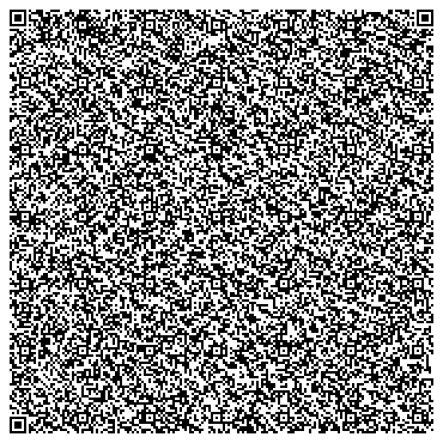
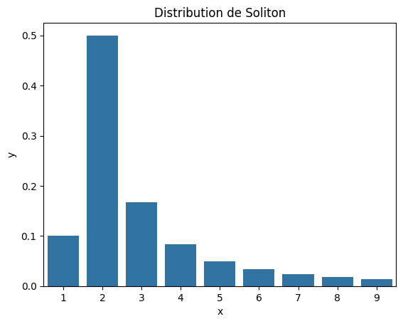

Title: Transférer un fichier via une fontaine de QR code
Slug: code-fontain
Date: 2024-10-28 19:30:31
Modified: 2024-10-28 19:30:31
Tags: algorithme
Category: informatique
Author: Sacha schutz
SIDEBARIMAGE:images/common/fontain_banner.png


Serait-il possible d’envoyer un fichier de 10 Mo en utilisant uniquement des [QR codes](https://fr.wikipedia.org/wiki/Code_QR) ? C’est la question que je me suis posé lorsque l’on m’a affirmé qu’il était impossible d'extraire des données d’une instance [Jupyter](https://fr.wikipedia.org/wiki/Jupyter) fonctionnant dans un [bureau virtuel](https://fr.wikipedia.org/wiki/Bureau_virtuel_(travail)).

Dans cet genre d'environnement, un data scientist est censé pouvoir effectuer des analyses, mais il lui est impossible de récupérer les données. Cependant, les données affichées à l’écran transitent forcément par la carte graphique de l’utilisateur, ce qui signifie qu’un pirate pourrait potentiellement récupérer l’intégralité d’un fichier volumineux en réalisant simplement des captures d’écran.

J’ai donc voulu tester cette théorie en tentant de transférer un fichier de 10 Mo à partir d’une séquence vidéo de QR codes, générée grâce à un algorithme particulièrement ingénieux : [le code fontaine de Luby](https://en.wikipedia.org/wiki/Luby_transform_code).

## Encoder des données dans un QR Code

La capacité de stockage d’un QR code varie en fonction de sa version et de son niveau de correction d'erreur. Dans le meilleur des cas, un QR code en version 40 (177 x 177) avec un niveau de [correction d'erreur](https://dridk.me/reed-solomon.html) faible (7 %) peut stocker jusqu’à 2 953 octets. Nous sommes encore loin des 10 Mo souhaités. Pour y remédier, il est donc nécessaire de générer plusieurs QR codes, que l’on pourra transmettre en masse dans un flux en stream ou via une vidéo.

Supposons que je génère 30 QR codes par seconde ; je pourrais ainsi récupérer des données à une vitesse de 480 Kbits/s (2 000 octets * 30 * 8 * 10⁻³). On est certes loin des vitesses de la fibre optique, mais au-dessus des performances d’un modem 56K.

<div class="figure"><div class="legend">
Animation à 30 frame par secondes de plusieurs QR code en version 40 encodant un fichier de 100 Ko.  
</div> 
</div>


## Utilisation du code fontaine
Plaçons-nous maintenant du côté du récepteur. En principe, il suffirait de faire des captures d’écran toutes les 4 ms pour décoder chaque QR code dans le bon ordre. Mais en pratique, il est très probable que certains QR codes soient manqués. Dans les protocoles classiques de communication réseau bidirectionnelle, comme [TCP](https://fr.wikipedia.org/wiki/Transmission_Control_Protocol), chaque capture ou [paquet](https://fr.wikipedia.org/wiki/Paquet_(r%C3%A9seau)) doit être confirmé par le récepteur avant d’envoyer le suivant. Ici, ce n’est pas envisageable, car notre communication est unidirectionnelle : nous ne faisons qu’écouter.

Une solution pourrait consister à demander à l'émetteur de répéter son message en boucle. Cependant, attendre un cycle complet pour récupérer un seul paquet manqué serait inefficace.     

La solution réside dans l'utilisation d'un [code fontaine](https://fr.wikipedia.org/wiki/Code_d%27effacement#Codes_fontaine_quasi-optimaux) qui génère des paquets de données aléatoires, étiquetés, qui sont émis continuellement comme une *fontaine de paquets*. Le récepteur n’a alors qu’à collecter les paquets dans le désordre et les réassembler.

Il existe une implémentation de code fontaine très efficace, appelée [transformation de Luby](https://en.wikipedia.org/wiki/Luby_transform_code) (ou code LT), que nous allons utiliser. Voici comment elle fonctionne.

### Fonctionnement de l'algorithme de Luby

Un code LT fonctionne de la façon suivante: 

#### Emetteur 

- Le message à transmettre est d'abord découpé en plusieurs blocs source de même taille.
- Un tirage aléatoire est ensuite effectué pour sélectionner N blocs source.
- La valeur de N est choisie selon une distribution de [Soliton](https://en.wikipedia.org/wiki/Soliton_distribution) (voir graphique ci-dessous).
- Ces N blocs source sont combinés à l’aide de l’opérateur [XOR](https://fr.wikipedia.org/wiki/Fonction_OU_exclusif) pour former un seul bloc encodé.
- Ce bloc encodé est ensuite transmis au récepteur avec un identifiant précisant le nombre de blocs source qu’il contient.
- Dans notre cas, ce bloc est transféré via un QR code, les 12 premiers octets étant réservés pour l’identifiant.

<div class="figure"><div class="legend">
Distribution de Soliton utilisé pour choisir le nombre de bloc source à combiner. 
Notez qu'il y aura principalement des combinaisons de 2 blocs et plus rarement des blocs seuls.

</div> 
</div>


#### Recepteur 

- Le récepteur collecte les paquets encodés en scannant les QR codes.
- Si un paquet est composé d’un seul bloc source, il le stocke directement.
- Si un paquet est composé de 2 blocs source, il applique un XOR avec un des paquets déjà reçus pour reconstruire le second bloc source.
- Il poursuit de cette manière avec les paquets contenant 3, 4 ... blocs 
- Une fois tous les paquets reçus et reconstruits, il les remet dans l’ordre pour reconstruire le message original.

En combinant les blocs avec un XOR, on peut transmettre statistiquement beaucoup moins de blocs que la méthode naïve, 
qui consisterait à les envoyer un par un.

Une implémentation de cet algorithme est disponible dans la bibliothèque [lt-code](https://github.com/anrosent/LT-code) en Python.


## Implementation en python 

Avec tous ces éléments, j'ai développé une petite librarie disponnible sur Github appelée [qrfontain](https://github.com/dridk/qrfontain/) qui permet de transférer des données via une flux de QR codes.

### Pour emettre un fichier

```python
import qrfontain 

with open("big.txt", "rb") as file:

  for image in qrfontain.data_to_qrcode(file):
    display(image)

```
### Pour recevoir un fichier

```python
import qrfontain 

with open("output.txt", "wb") as file:

  # Get QR Code images 
  data = qrfontain.data_from_qrcode(image_generator)
  file.write(data)

```

### Experience

Pour l'expérience, j'ai créé trois fichiers de tailles différentes (100 Ko, 1 Mo et 10 Mo) que j'ai encodés dans une vidéo de QR codes à 30 images par seconde.
Pour le décodage, j'ai développé une interface graphique en [Qt](https://doc.qt.io/qtforpython-6/) capable de capturer des QR codes à 60 fps. J'utilise [QScreen.grabWindow](https://doc.qt.io/qt-6/qscreen.html#grabWindow) pour prendre des captures d'écran et [zbarlight](https://github.com/Polyconseil/zbarlight) pour la détection des QR codes. L'application permet de sélectionner une région de l’écran via un carré transparent pour capturer les QR codes et récupérer les données transmises. Voir la vidéo ci-dessous. C'est assez satisfaisant, on a l'impression de récupérer un signal radio extra-terreste. 


<center>
<video width="600" controls>

<source src="images/fontain/gui_receiver.webm" type="video/webm" />

</video>
</center>

### Resultats 

Et voilà les temps de téléchargement pour 3 fichiers de tailles différentes : 

- 0.1 Mo : 9446 ms
- 1   Mo : 50464 ms
- 10  Mo : 466420 ms 

Il me faut donc 7 minutes pour télécharger un fichier de 10 Mo. 
La relation est linéaire avec une vitesse avoisinant les 180 kbits/s soit 3 fois plus rapide 
qu'un modem 56K. 

### Conclusion 

Avec un peu plus d'effort, je pense qu'il serait facile de transmettre des données plus rapidement.  
Nous pourions par exemple jouer avec le framerate ou en parallelisant avec plusieurs QR code.   
Après nous serons toujours limités par la bande passante et le taux de rafraichissement d'une image. 

J'avais au début envisagé de transmettre les données en utilisant les pixels et les couleurs d'une image. 
Cependant, il est très difficile de récupérer les informations de manière fiable à partir d'une capture d'écran.
L'antialiasing et les transformations de rendu déforment les données encodées, rendant leur décodage impraticable.
Si vous avez d'autres idées, n’hésitez pas à les partager dans les commentaires !

## Reference 

- [qrfontain](https://github.com/dridk/qrfontain/tree/main?tab=readme-ov-file): Ma petite librarie python
- [divan.dev](https://divan.dev/posts/fountaincodes) : Fountain codes and animated QR
- [Nick's Blog](http://blog.notdot.net/2012/01/Damn-Cool-Algorithms-Fountain-Codes) : Damn Cool Algorithms: Fontain Codes
- [qram](https://github.com/digitalbazaar/qram) : Autre implementation Javascript
- [txqr](https://github.com/divan/txqr): Autre implementation en Go


 


