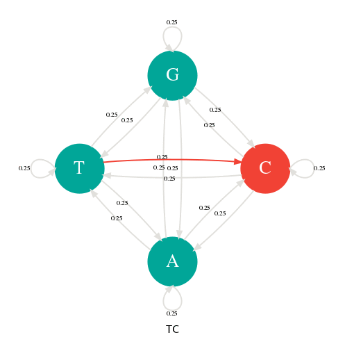
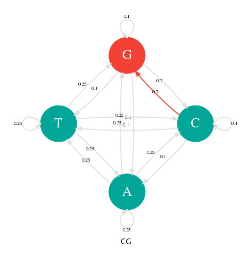
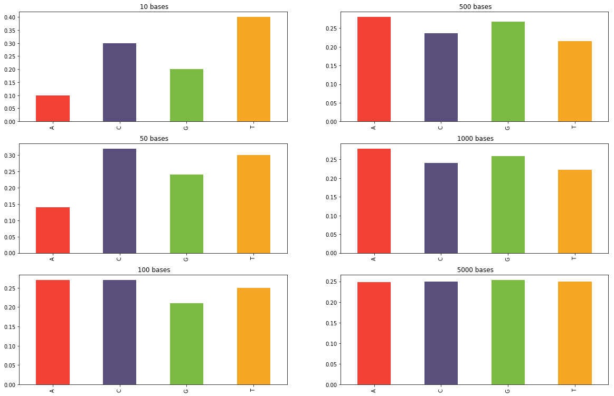
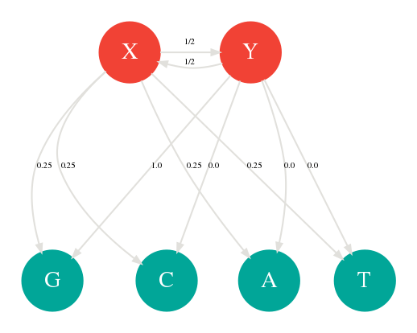
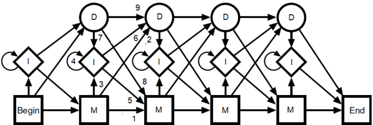

Title: Les chaînes de Markov
Slug: chaine-de-markov
Date: 2019-12-24 12:44:30
Modified: 2019-12-24 12:44:30
Tags: statistique,maths,machine learning
Category:informatique
Author: Sacha Schutz
SIDEBARIMAGE:images/common/stat_banner.jpg

Les [chaînes de Markov ](https://fr.wikipedia.org/wiki/Cha%C3%AEne_de_Markov)sont très populaires en bioinformatique, en particulier lorsque l'on travaille avec des séquences biologiques. 
J'aime bien me les représenter comme des machines générant des symboles aléatoires (ou [processus stochastique](https://fr.wikipedia.org/wiki/Processus_stochastique))  dont la probabilité d'apparition de chacun dépend du précédent.    
Dans ce billet, nous allons les définir et voir comment nous pouvons les utiliser en pratique.

## Un dé à 4 faces
Imaginez un dé à 4 faces sur lequel sont représentées les quatre bases A,C,G,T de l'ADN. Lancez ce dé plusieurs fois en notant chaque résultat.
Par exemple, le premier lancé vous donne un A, le deuxième un T, le troisième un A et ainsi de suite jusqu'à générer une longue séquence.
Si le dé n'est pas truqué, à chaque lancée, vous avez exactement une chance sur 4 d'obtenir chacune des quatre bases.         
Une façon de représenter ce tirage aléatoire est d'utiliser un [graphe](https://fr.wikipedia.org/wiki/Th%C3%A9orie_des_graphes), appelé diagramme de transition, ou chaque nœud représente les bases ou **états** et les arrêtes les probabilités de **transitions**. Dans la figure ci-dessous, il y a 4 états (A,C,G,T) et 16 transitions avec leurs probabilités toutes égales à 1/4. Par exemple, la probabilité d'obtenir un C après en A est de 1/4 et de même pour les autres transitions.
Pour générer une séquence aléatoire, choisissiez un nœud au hasard, puis faite une marche dans ce graphe en suivant les probabilités de transition. Notez la valeur de chaque nœud traversé. Bravo, vous venez de générer une séquence à l'aide une chaîne de Markov. 

           
Génération d'une séquence avec une chaîne de Markov.  Il y a 4 états (A,C,G,T) et 4x4=16 transitions possibles toutes avec une probabilité de 1/4
 
   

## Définition d'une chaîne de Markov
Une chaîne de Markov se définit donc par un vecteur d'état **E** et une matrice de transition **T**.    
Dans notre cas, il y a 4 états possibles soit:

 $$E = \{A,C,G,T\}$$ 

 Et 16 probabilités de transition, noté $p(N_{t+1}|N)$ , que l'on représente par une [matrice](https://fr.wikipedia.org/wiki/Matrice_(math%C3%A9matiques)#Alg%C3%A8bre_des_matrices_carr%C3%A9es) carrée  avec dans l'ordre A,C,G,T pour les lignes et les colonnes. Par exemple la transition *p(A|A)* (A précédé de A)  se lis dans la matrice aux coordonnées (0,0). La transition p(A|C) ( A précédé de C), aux coordonnées (0,1) .

$$
T = \begin{bmatrix}
1/4 &  1/4 & 1/4 & 1/4 \\ 
1/4 & 1/4  & 1/4 & 1/4\\ 
1/4 & 1/4 & 1/4 & 1/4\\ 
1/4 & 1/4 & 1/4 & 1/4 \\
\end{bmatrix}
$$

En changeant les probabilités de transition, nous pouvons alors paramétrer notre générateur pour qu'il produise des séquences avec des profils particuliers. Dans la figure suivante, j'ai donné une probabilité de 0.7 aux transitions p(G|C) et p(C|G). Avec cette nouvelle table de transition, je peux alors générer des séquences riches en GC comme l'illustre l'animation suivante.

           
 Les probabilités de transitons ont changé en faveur de G->C et C->G.   La séquence générée est riche en GC 
 
   

## Distribution stationnaire
En faisant tourner votre générateur assez longtemps et en comptant la fréquence d'apparition de chaque base, vous obtiendrez une [distribution](https://fr.wikipedia.org/wiki/Distribution_statistique) [stationnaire](https://fr.wikipedia.org/wiki/Probabilit%C3%A9_stationnaire_d%27une_cha%C3%AEne_de_Markov) au bout d'un certain temps. C'est-à-dire que peut importe la longueur de la séquence, la probabilité d'avoir une certaine base dans la séquence sera toujours la même. 
Les histogrammes ci-dessous montrent la fréquence des bases obtenues parmi les N premiers nucléotides générées par une chaîne de Markov en utilisant la matrice de transition du dé à 4 faces équiprobables. Comme on peut s'y attendre, cette distribution converge pour devenir uniforme.  

           
 Distributions des bases sur un génération de N bases.   La distribution converge pour devenir uniforme
 
   

Ces distributions se calculent en faisant un peu d'algèbre linéaire. 
On choisi de représenter la distribution des 4 bases par un vecteur $\pi_{t} = [pA, pC, pG, pT]$ à un temps donné t . Par exemple, si nous choisissons une séquence commençant par un A, alors la distribution au temps $t0$ est = [1,0,0,0].
On peut alors calculer la distribution au temps t+1 en faisant le [produit](https://fr.wikipedia.org/wiki/Produit_vectoriel) du vecteur par la matrice de transition T: 

$$
\pi_{t+1} = \pi_{t} T
$$

De façon générale, on peut calculer la distribution au temps n par :

$$
\pi_{n} = \pi_{0}T^n
$$

Trouver la distribution stationnaire, c'est chercher celle qui ne change pas entre deux temps. C'est-à-dire résoudre l'équation suivante :

$$
\pi = \pi T
$$

Sachant cela, vous allez pouvoir construire des chaînes de Markov avec la distribution stationnaire de votre choix.   
De façon beaucoup plus générale, utiliser les chaînes de Markov comme générateurs aléatoires d'une distribution particulière est à la base des [algorithmes MCMC](https://fr.wikipedia.org/wiki/M%C3%A9thode_de_Monte-Carlo_par_cha%C3%AEnes_de_Markov). Principalement en [inférence bayésienne](https://fr.wikipedia.org/wiki/Inf%C3%A9rence_bay%C3%A9sienne) pour calculer une distribution a posteriori. Mais ça, c'est une autre histoire ! 

## Un modèle d'apprentissage 
Si maintenant, au lieu de générer des séquences à partir d'une chaîne de Markov nous faisions l'inverse. C'est-à-dire construire une chaîne de Markov après avoir observé une famille de séquence. Par exemple, les séquences de  différents [promoteurs](https://fr.wikipedia.org/wiki/Promoteur_(biologie)). Cette chaîne servirait alors de modèle pour représenter cette famille. Pour cela il suffit de comptabiliser toutes les transitions existantes dans un jeu de séquence pour déduire les probabilités de la matrice de transition.      
Parmi les séquences suivantes, il y a 5 transitions T->A sur 32 transitions possibles. On note alors dans la matrice de transition que la probabilité p(A|T) est de 5/32. On fait de même pour les autres transitions pour obtenir une matrice complète.

 <code> <b style="color:red">TA</b>CGC  
CCT<b style="color:red">TA</b>  
GCCGC  
AG<b style="color:red">TA</b>G  
AGCGC  
C<b style="color:red">TA</b><b style="color:red">TA </b> 
GTGCA 
CGCCA   </code> 
Dans cette série, il y a 32 transitions. Parmi elles, 5 sont des transitions T->A. La probabilité est donc de 5/32
 

Une fois la chaîne de Markov définie, il est alors possible d'utiliser ses probabilités pour générer une nouvelle séquence semblable à celles utilisées dans la construction du modèle. C'est de cette façon que les générateurs de texte aléatoires fonctionnent. Par exemple, ce site qui génère des [Tweets de Donald Trump](https://filiph.github.io/markov/).    
En génétique, on va plutôt tester si une nouvelle séquence a le même profil que les séquences du modèle. Par exemple quelle est la probabilité que la séquence ATTCG soit une séquence du modèle $\theta$ ? 
Étant donné que la probabilité d'apparition d'une base dépend uniquement de la précédemment, la probabilité de ATTCG peut s'écrire comme le produit de chaque transition: 

$$
p(ATTCG|\theta) = p(A) * p(T|A) * p(T|T) * p(C|T) * p(G|C)
$$

Ou plus généralement : 

$$
P(S|\theta) = \prod_{0}^{n} p(S_{n}|S_{n-1}) 
$$

Et comme les additions c'est mieux que les multiplications, on calcule la vraisemblance via le logarithme: 

$$
L_{\theta}(S) = \sum_{0}^{n} log(p(S_{n}|S_{n-1})) 
$$

En lisant les probabilités de la table de transition, on peut alors calculer cette vraisemblance pour évaluer le degré d'appartenance d'une séquence à sa famille. Ce genre d'algorithme s'utilise par exemple pour identifier des familles de protéines. L'algorithme [HMMER](https://en.wikipedia.org/wiki/HMMER) fonctionne de la même façon, mais en utilisant des chaînes de Markov plus complexe, appelé chaîne de Markov caché que je vais décrire rapidement.

## Les chaînes de Markov cachées 
Une [chaîne de Markov cachée](https://fr.wikipedia.org/wiki/Mod%C3%A8le_de_Markov_cach%C3%A9) ou HMM ( Hidden Markov Model) est simplement une chaîne de Markov dont certains des états sont cachés. Plus précisément ce sont des états qui ne font pas partie de la séquence générée. Reprenons notre dé et appelons le **X**. Ajoutons un deuxième dé truqué appelé **Y** contenant uniquement des G sur ces 4 faces. On lance toujours un seul dé pour générer une séquence. Sauf que cette fois, à chaque lancée, il y a une chance sur 2 que nous changions de dé en cachette.  On dit que **X** et **Y** sont les états cachés avec 4 probabilités d’émissions chacun. Cette chaîne de Markov peut être représentée par le graphe suivant:

           
Chaîne de Markov caché avec 2 états cachés X et Y et 4 émissions
 
   

Ces 2 états cachés peuvent représenter par exemple les introns et les exons. Les probabilités d’émissions seront différentes selon l'état caché en cours. 
Il est peut être plus rare par exemple d'avoir du GC dans un exon que dans un intron. 
On utilise également les chaînes de Markov caché pour modéliser les insertions et les délétions. Le graphe ci-dessous vous montre une chaîne de Markov particulière prenant en compte les positions comme états cachés avec leurs 4 émissions possibles A,C,G,T. En lisant de gauche à droite, ce générateur est capable de produire la séquence ACAATC ou ACACCCCCATC grâce à plusieurs insertions en position 3.

           
Dans cette chaîne de Markov, les positions sont prises en compte. En position 3, il y a 60% de chance d'avoir une insertion
 
   

Comme vu plus haut, il est possible de construire une chaîne de Markov caché en apprenant depuis un corpus de séquence. Mais cette fois, les probabilités de transitions cachées sont beaucoup plus difficiles à calculer, car on ne les observe pas. 
On peut les estimer en cherchant les valeurs les plus vraisemblance avec par exemple l'[algorithme de Baum-Welch](https://fr.wikipedia.org/wiki/Algorithme_de_Baum-Welch). Il s'agit d'un algorithme d'espérance maximisation que nous avons déjà vue dans un [autre billet](expectation-maximisation.html). Notez aussi l'algorithme de [Viterbi](https://fr.wikipedia.org/wiki/Algorithme_de_Viterbi) qui permet d'identifier le chemin le plus probable, lorsqu'on désire aligner une séquence sur un profil HMM. 

## En bref 
Les chaînes de Markov sont des processus stochastiques dont l'état futur dépend uniquement du présent. Elles peuvent être utilisées en génétique pour générer des séquences, mais surtout comme modèle d'apprentissage comme les profils HMM.
Elles sont à la base des algorithmes MCMC faisant partie des plus beaux [algorithmes du XXe siècle](https://cs.gmu.edu/~henryh/483/top-10.html), rien que ça! 

### Référence 
- [Mon notebook pour ce billet](https://github.com/dridk/notebook/blob/master/markov/Markov.ipynb)
- [http://nazejournal.free.fr](http://nazejournal.free.fr/article.php?page=chaines-markov)
- [https://mattiacinelli.com](https://mattiacinelli.com/
hidden-markov-model-applied-to-biological-sequence-part-2/)
- [https://bioinfo-fr.net/](https://bioinfo-fr.net/suivez-le-guide-en-quete-de-hmm)