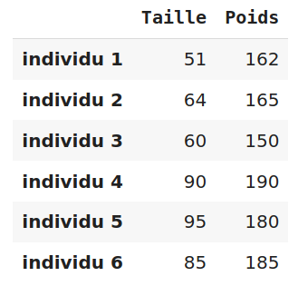
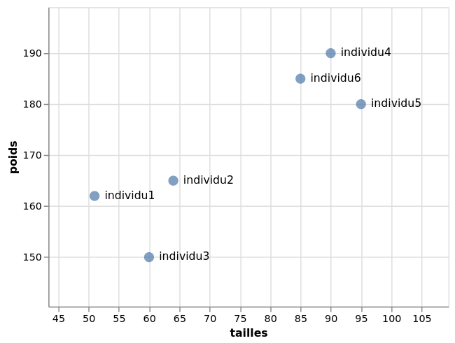
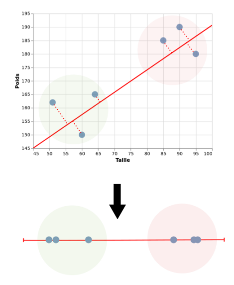
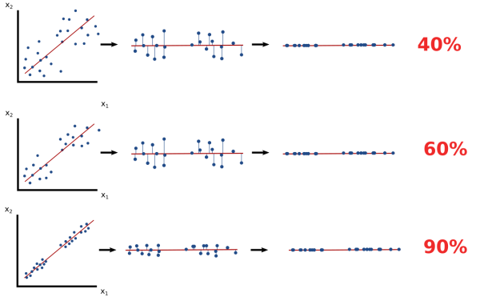
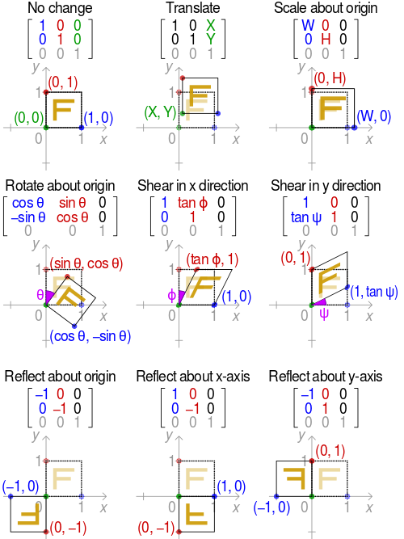
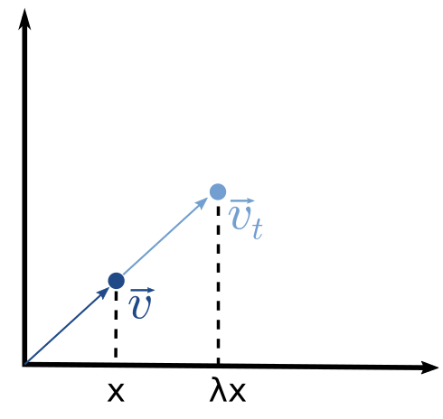
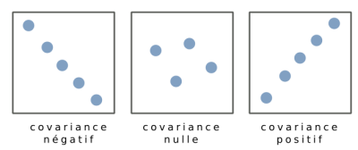
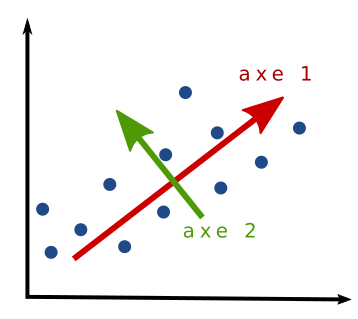
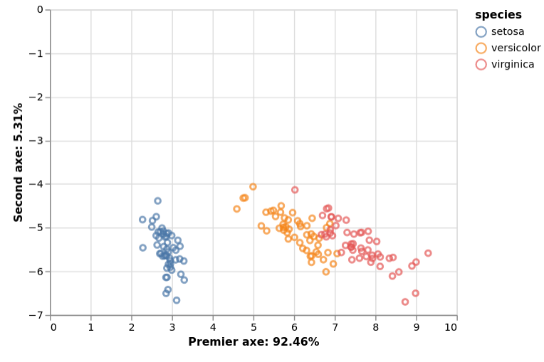

Title: L'analyse en composante principale
Slug: analyse-en-composante-principale
Date: 2020-09-20 18:34:56
Modified: 2020-09-20 18:34:56
Tags: statistique,machine learning,python
Category: informatique
Author: Sacha SCHUTZ
SIDEBARIMAGE:images/common/stat_banner.jpg

[L'analyse en composante principale](https://fr.wikipedia.org/wiki/Analyse_en_composantes_principales) ou PCA (Principal component analysis) est une méthode de [réduction de dimension,](https://fr.wikipedia.org/wiki/R%C3%A9duction_dimensionnelle) largement utilisée en [statistique descriptive](https://fr.wikipedia.org/wiki/Statistique_descriptive), pour visualiser sur un graphique à 2 ou 3 dimensions des données décrites sur plus de dimensions. 
Dans ce billet, nous chercherons d'abord à comprendre le principe général avec l'exemple simple d'un passage de 2 dimensions à 1 dimension. Puis nous détaillerons les bases mathématiques sous-jacentes et comment réaliser cette transformation en Python.

## Tout commence avec un tableau
Chaque fois que je suis amené à analyser des données, mon premier réflexe et d'identifier un tableau ou chaque ligne représente une observation et chaque colonne une variable décrivant l'observation. 
Par exemple le tableau suivant, représente la taille et le poids chez 6 individus:

<div class="figure"><div class="legend">
Tableau de données avec 6 observations et deux variables.
</div> 
</div>

D'un point de vue géométrique, nous pouvons représenter chacune de ces 6 observations par un point (ou vecteur) dans un [espace](https://fr.wikipedia.org/wiki/Dimension_d%27un_espace_vectoriel) à 2 dimensions correspondant aux deux variables. Ce graphique nous montre alors la proximité entre les observations. Par exemple sur le graphique ci-dessous, les individus 1,2,3 et les individus 4,5,6 forment respectivement deux groupes.


<div class="figure"><div class="legend">
Représentation dans un espace à deux dimensions du tableau de données. Chaque observation est représentée par un point ou vecteur.
De façon générale, les M observations d'un tableau de données peuvent être vu comme les M vecteurs dans un espace à N dimensions. L'ensemble formant une matrice de dimension NxM.
</div> 
</div>

En ajoutant une nouvelle variable dans ce tableau, par exemple l'âge d'un individu, nous pouvons représenter les observations par un graphique à 3 dimensions. Mais avec plus de variables, et donc plus de dimensions cela devient problématique.      
La solution à ce problème est la réduction de dimension en transformant par exemple un tableau à 10 variables vers un tableau à 2 variables facilement représentable sur un graphique.   
Pour comprendre comment cette transformation fonctionne, partons d'un cas simple: La réduction d'un tableau à 2 dimensions vers un tableau à 1 dimension. Il suffira ensuite de généraliser cette méthode à N dimensions.

## Passage de 2 dimensions à 1 dimension
Pour faire cette transformation, il faut s'imaginer un axe passant au mieux par tous les points. Puis faire la projection de chaque point sur cet axe. 
Cet axe ou composante principale est une nouvelle dimension fictive qui nous permet de représenter les observations sur 1 dimension. Et comme vous pouvez le constater sur le graphique ci-dessous, les deux groupes identifiables dans l'espace bidimensionnel l'est toujours dans ce nouvelle espace unidimensionnel.

<div class="figure"><div class="legend">
Réduction de dimensions d'un espace à 2 dimensions vers in espace à 1 dimension. Les deux groupes d'individus sont toujours identifiables.
</div> 
</div>

Il faut cependant garder en tête qu'il y a une perte d'information lorsque l'on réalise cette transformation. Des données différentes avant transformation peuvent aboutir aux mêmes résultats. Plus les points sont corrélés entre eux, et plus l'information récupérée après la réduction de dimension sera grande. Une réduction de dimension par PCA doit donc **TOUJOURS** s'accompagner de la quantité d'information récupérée pour être interprétable.

<div class="figure"><div class="legend">
Réduction de dimensions d'un espace à 2 dimensions vers un espace à 1 dimensions. 
Dans les 3 exemples, la réduction de dimensions amène aux mêmes résultats. La différence est liée à la quantité d'information récupérée par la composante principale. Le premier graphique récupère que 40% de l'information tandisque la dernière récupère 90% de l'information.
</div> 
</div>


## Comprendre le calcul 
Nous allons maintenant voir comment trouver ces axes par le calcul, pour ensuite généraliser la méthode à N dimensions. Pour cela, quelque prérequis d'[algèbre linéaire](https://fr.wikipedia.org/wiki/Alg%C3%A8bre_lin%C3%A9aire) sont nécessaires. 

### Transformation linéaire

En multipliant un [vecteur](https://fr.wikipedia.org/wiki/Vecteur) $\vec{v}$ (un point) par une [matrice](https://fr.wikipedia.org/wiki/Matrice) $M$  on obtient un nouveau vecteur $\vec{v_t}$. Autrement dit, on déplace le point vers un autre endroit grâce à une [matrice de transformation](https://en.wikipedia.org/wiki/Transformation_matrix).

$$ 
\vec{v_t} = M \vec{v}
$$

Par exemple, en infographie, on utilise ces matrices pour réaliser différente transformation d'objet comme des rotations, des déformations, des agrandissements etc ...  
Dans l'exemple ci-dessous, les 3 vecteurs (bleu, vert, rouge) définissent un carré. En faisant le produit de chaque vecteur par une matrice de  transformation, on obtient 3 nouveaux vecteurs représentant le carré transformé. Essayer [ce site ](https://web.ma.utexas.edu/users/ysulyma/matrix/)pour tester.

<div class="figure"><div class="legend"> Différente matrice de transformation sur un un objet à 3 vecteurs<a href="https://en.wikipedia.org/wiki/Transformation_matrix"> Source </a></div> </div>


### Vecteur propre et valeur propre 

Les [vecteurs propres ](https://fr.wikipedia.org/wiki/Valeur_propre,_vecteur_propre_et_espace_propre)(eigen vector) d'une matrice de transformation sont les vecteurs qui ne changent pas de direction après transformation. Chacun de ces vecteurs est associé à une [valeur propre](https://fr.wikipedia.org/wiki/Valeur_propre,_vecteur_propre_et_espace_propre) $\lambda$ (eigen value) indiquant le degré d'élongation. 

<div class="figure"><div class="legend">
Transformation d'un vecteur propre v par une matrice de transformation. Le vecteur transformé vt conserve sa direction. La valeur propre est de 2.
</div> 
</div>


### Calcul du vecteur et de la valeur propre
Pour trouver les vecteurs et valeurs propres d'une matrice A: 

$$ A = \begin{bmatrix}
a & b \\ 
c & d 
\end{bmatrix}
$$

<center>Il faut donc résoudre l'équation suivante.</center>

$$A\vec{v} = \lambda \vec{v}$$

<center>Ce qui revient à résoudre : </center>

$$(A-\lambda I) \vec{v} = \vec{0}$$

<center>Cette équation admet des solution(s) $\lambda$ si :</center> 

$$det(A-\lambda I) = 0 $$

<center>C'est à dire : </center>
$$ det (\begin{bmatrix}
a - \lambda & b \\ 
c & d - \lambda
\end{bmatrix}) = 0
$$

<center>Pour trouver $\lambda$ il suffit donc de résoudre : </center>

$$
(a - \lambda)(c - \lambda) - bc = 0
$$

En remplaçant lambda dans l'équation d'origine, nous trouvons alors les vecteurs propres associés.     
Avant de comprendre en quoi les vecteurs propres sont utiles pour notre réduction de dimension, il nous faut encore définir une chose: *la matrice de covariance*.

### Matrice de covariance 
**La variance** d'une variable x, informe de la dispersion des données autour de la moyenne. C'est la moyenne de tous les écarts à la moyenne au carré.
Elle s'écrit : 

$$var(x) = \frac{1}{N} \sum_{i=0}^{n} (x-\bar{x})^{2}$$

Dans notre tableau, la variance de la taille et du poids sont respectivement de 328.5 et 238.

**La covariance** entre deux variables indique la variance d'une variable x par rapport à une variable y. Elle indique le degré de corrélation entre deux variables. Elle s'écrit :

$$cov(x,y) = \frac{1}{N} \sum_{i=0}^{n} (x_i - \bar{x})(y_i - \bar{y})$$

Plus les variables x et y sont corrélé, plus la valeur absolue de la covariance est grande : 

<div class="figure"><div class="legend">

</div> </div> 

**La matrice de covariance** est une matrice carrée contenant l'ensemble des covariances entre variables prises 2 à 2. 

$$M = \begin{bmatrix}
cov(x,x) & cov(x,y) \\ 
cov(y,x) & cov(y,y) 
\end{bmatrix}$$


### Trouver les axes principaux
Vous avez maintenant tous les ingrédients pour comprendre comment trouver les axes passant aux mieux par vos données. Car voilà... Les axes d'une analyse en composante principale correspondent aux **vecteurs propres** de la matrice de covariance de vos données. Et la quantité d'information récupérée par chaque axe correspond aux **valeurs propres** de leurs vecteurs associés. 

<div class="figure"><div class="legend">
Les vecteurs propres de la matrice de covariance correspondent aux deux axes passant aux mieux par les données. Ici l'axe 1 récupère davantage d'information que l'axe 2. 
Les vecteurs propres sont toujours orthogonaux entre eux.
</div> 
</div>

En généralisant, pour réduire un espace à N dimensions vers un espace à K dimensions, il suffit de faire la projection des points de l'espace de départ sur les K premiers vecteurs propres qui récupère le maximum d'information. C'est à dire ceux qui ont les valeurs propres les plus grande. 
Passons à la pratique pour voir, en réalisant toutes ces opérations en Python.

## Analyse en composante principale en Python 

Nous allons utiliser le [jeux de données iris](https://fr.wikipedia.org/wiki/Iris_de_Fisher) contenant 50 observations de fleurs et 4 variables (ou 4 dimensions) et les réduire sur une espace à deux dimensions. 

```python
import numpy as np 
import pandas as pd
import altair as alt
from numpy import linalg as LA
from sklearn import datasets
from sklearn.decomposition import PCA

# Téléchargement du jeux de données iris 

data, species = datasets.load_iris(return_X_y=True)

data = pd.DataFrame(data)
species = pd.DataFrame(species)

# Calcul de la matrice de covariance 
cov_matrix = data.cov()

# Calcul des vecteurs et valeurs propres de la matrice de covariance 
eigen_values, eigen_vectors = LA.eig(cov_matrix)

# Calcul de l'information récupéré en pourcentage sur les 2 premiers axes
info = (eigen_values / sum(eigen_values) * 100).round(2)
axe1_info = info[0]
axe2_info = info[1]

# Projection des points sur les deux premiers vecteurs 
projection_matrix = eigen_vectors.T[:][:2].T
data_t = data.dot(projection_matrix)

# Affichage des nouvelles données à 2 dimensions
data_t.columns = ["axe1", "axe2"]
data_t["species"] = species

alt.Chart(data_t).mark_point().encode(
    x=alt.X("axe1", title=f"axe 1 {axe1_info}%"), 
    y=alt.Y("axe2", title=f"axe 2 {axe2_info}%"), 
    color="species:N")

```


<div class="figure"><div class="legend">
Réduction d'un espace à 4 dimensions vers un espace à 2 dimensions.
</div> </div> 

Ce graphique représente donc la projection d'observation d'un espace à 4 dimensions vers un espace à deux dimensions. Ces 2 axes sont accompagnés du pourcentage d'information récupéré grâce aux valeurs propres. Le premier axe récupère 92,46% de l'information puis le second récupère 5.31%. Au total, les 2 premiers axes ont récupéré plus de 97% de l'information. Et comme les couleurs nous le montre, nous constatons que les fleurs de la même espèce sont à proximité dans cette espace bidimensionnel. 


## Conclusion 
Nous avons vu dans ce billet, comment réaliser une analyse en composante principale pas à pas. Bien entendu, il existe des librairies permettant de réaliser cette transformation en une ligne, comme [ici avec sklearn](https://scikit-learn.org/stable/auto_examples/decomposition/plot_pca_iris.html). Mais, c'est toujours bien de comprendre comment ça marche ! 
Par ailleurs, l'analyse en composante principale est une méthode parmi d'autres, de réduction de dimension. Il en existe d'autres avec chacune leurs avantages. Notamment des méthodes non linéaires comme [t-SNE](https://fr.wikipedia.org/wiki/Algorithme_t-SNE) ou [UMAP](https://en.wikipedia.org/wiki/Nonlinear_dimensionality_reduction). 
Sachez aussi que la PCA a d'autres applications en informatique, notamment dans le traitement d'image, la compression et la réduction du bruit. En effet si vous faites une PCA sur une image, vous récupérer le maximum d'information utile sans le bruit. En faisant l'inverse d'une PCA, vous reconstituerez alors une image débruitée. 


## Réferences 
- [Statquest (youtube) ACP en 5 minutes](https://www.youtube.com/watch?v=HMOI_lkzW08)
- [The Jewel of the Matrix: A Deep Dive Into Eigenvalues & Eigenvectors](https://towardsdatascience.com/the-jewel-of-the-matrix-a-deep-dive-into-eigenvalues-eigenvectors-22f1c8da11fd)
- [A geometric interpretation of the covariance matrix](https://www.visiondummy.com/2014/04/geometric-interpretation-covariance-matrix/)
- [PCA: Principal Component Analysis](https://medium.com/@kyasar.mail/pca-principal-component-analysis-729068e28ec8)


