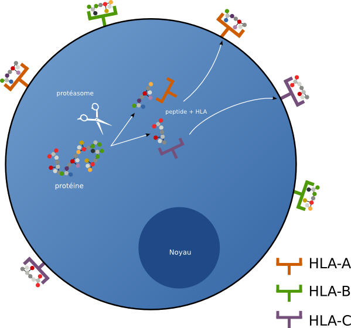
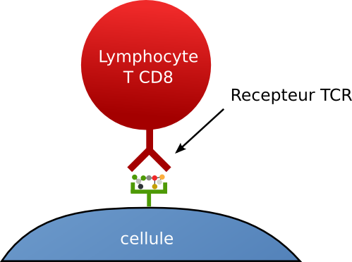
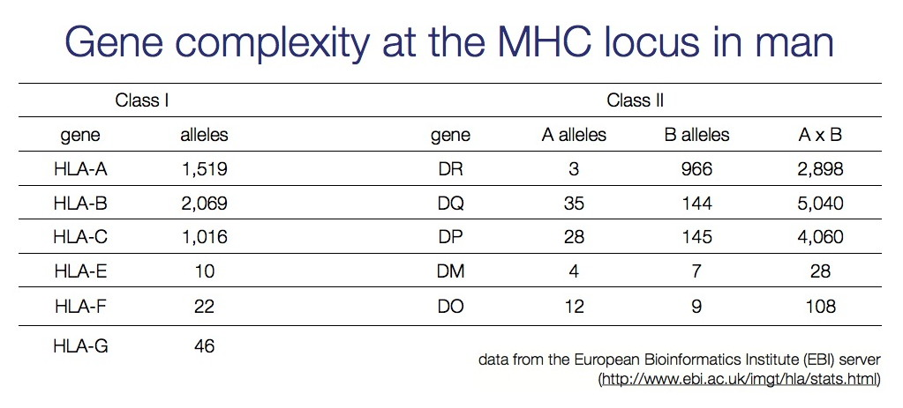
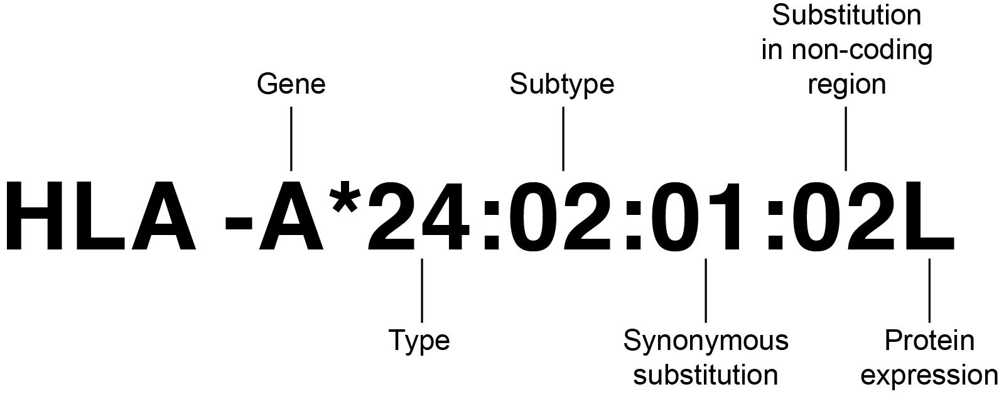

Title: La reconnaissance du soi
Slug: reconnaissance_soi
Date: 2016-02-27 10:57:22
Tags: génétique, immunologie
Category: biologie
Author: Sacha Schutz
SIDEBARIMAGE:images/common/immuno_banner.jpg

Si vous lisez mon blog, vous avez sûrement constaté ma tendance à tracer des parallèles entre l'informatique et la génétique, notamment entre séquence d'ADN et séquence binaire. Dans cet article, nous allons à nouveau faire un parallèle qui peut paraître tout aussi surprenant : **La reconnaissance du soi**.   
Du point de vue de l'informatique, il s'agit de vérifier si un fichier est bien le votre et qu'il n'a pas été modifié par un virus.   
Du point de vue de la biologie, on rencontre le même problème: vérifier qu'une cellule est saine et qu'elle n'a pas été infectée par un virus !  
Dans les deux cas nous allons utiliser des "**signatures**" et toute anomalie dans celles-ci révélera l'imposture.   

## Signature d'un fichier
La *signature* ou *empreinte* d'un fichier est une séquence de caractères associée de façon unique à un fichier. Par exemple, le fichier **superMario.exe** peut avoir comme empreinte *f6c51c6bb1ce72508313dad3dc3c6776*. Toute modification du fichier, même minime, entraînera une modification de l'empreinte.   
Cette prouesse est réalisée à l'aide des [fonctions de hachages](https://fr.wikipedia.org/wiki/Fonction_de_hachage). Les algorithmes [MD5](https://fr.wikipedia.org/wiki/MD5) et [SHA-1](https://fr.wikipedia.org/wiki/SHA-1) sont les plus connus.    
Depuis un terminal [Unix](https://fr.wikipedia.org/wiki/Unix), vous pouvez récupérer l'empreinte de n'importe quel fichier en tapant : 

    md5sum superMario.exe   
    ## Retourne: 50e6b5cd621b4f9de2cc78669cd0c350

L'empreinte obtenue est une séquence de 128 bits soit une chaîne hexadécimale de 32 caractères. La probabilité que deux fichiers aient la même empreinte est extrèmement faible mais une telle éventualité est possible, on parle alors de "*collision*".    
Lorsque vous distribuez un fichier, l'empreinte peut être données depuis votre page web, ce qui permettra aux utilisateurs d'en vérifier l'authenticité. Par exemple, à partir de la [page de téléchargement de kubuntu](http://cdimage.ubuntu.com/kubuntu/releases/wily/release/), il est possible de récupérer les empreintes des images ISO à partir du fichier [MD5SUMS](http://cdimage.ubuntu.com/kubuntu/releases/wily/release/MD5SUMS). 
Les antivirus utilisent également cet outil. Ils peuvent calculer l'empreinte de l'ensemble de vos fichiers et si un virus contamine l'un d'eux, l'empreinte est modifiée et notre cher [Avast](https://fr.wikipedia.org/wiki/Avast!) va sonner l'alarme !

## Signature d'une cellule 
Quel rapport avec une cellule ? Et bien, la majorité de nos cellules possèdent à leur surface une empreinte formée par le **[complexe majeur d'histocompatibilité](https://fr.wikipedia.org/wiki/Complexe_majeur_d'histocompatibilit%C3%A9)** qu'on appelle plus couramment par son acronyme **CMH**. Toute modification de cette empreinte (par un virus par exemple), sera reconnue par le système immunitaire et déclenchera la mort de la cellule. C'est également à cause de ce même mécanisme que les greffes d'organes sont rejetées, car reconnues  étrangères. 

### Les molécules du CMH. 
Les molécules du CMH sont des [glycoprotéines](https://fr.wikipedia.org/wiki/Glycoprot%C3%A9ine) situées sur la membrane de la quasi totalité de nos cellules. Leur rôle est de présenter des courts fragments peptidiques au système immunitaire. Il en existe différents types, codés par des gènes localisés sur le bras court du chromosome 6 et regroupés en plusieurs classes. Dans cet article, nous nous intéressons uniquement à la [classe I](https://fr.wikipedia.org/wiki/Complexe_majeur_d'histocompatibilit%C3%A9#CMH_de_classe_I), composée des 3 gènes: [HLA-A](http://www.ensembl.org/Homo_sapiens/Gene/Summary?db=core;g=ENSG00000206503;r=6:29941260-29945884), [HLA-B](http://www.ensembl.org/Homo_sapiens/Gene/Summary?db=core;g=ENSG00000234745;r=6:31353872-31357188) et [HLA-C](http://www.ensembl.org/Homo_sapiens/Gene/Summary?db=core;g=ENSG00000204525;r=6:31268749-31272130).  
Ces gènes codent chacun pour une glycoprotéine membranaire composée d'un pochoir où se lie un peptide par complémentarité. Il s'agit donc d'une liaison spécifique, c'est à dire que les molécules HLA-A ne fixent pas les mêmes peptides que les molécule HLA-B. 

### La fonction de hachage cellulaire 
Une cellule est définie par ses constituants. Dans notre cas, l'ensemble des protéines synthétisées par la cellule  participera à la création d'une empreinte. Ces protéines sont découpées en petits fragments de 9 acides-aminées par le [protéasome](https://fr.wikipedia.org/wiki/Prot%C3%A9asome). Ceux-ci se fixent ensuite par complémentarité sur les molécules du CMH à destination de la membrane cellulaire.    
La combinaison des peptides présentée à la surface est la signature ou l'empreinte de la cellule.  

    

### La reconnaissance du CMH
Les [lymphocytes T cytotoxiques](https://fr.wikipedia.org/wiki/Lymphocyte_T_cytotoxique) (TCD8) sont des globules blancs dont la mission est de tester l'intégrité des cellules en vérifiant leurs CMH par leurs récepteurs TCR. Ils reconnaissent à la fois la molécule du CMH et le peptide associé.   
Au cours de la formation du système immunitaire, par un mécanisme encore non élucidé, les lymphocytes T deviennent tolérants aux peptides du soi. C'est à dire aux peptides présentés normalement par le CMH.   
Plus tard, lors d'une infection par un virus, celui-ci génère de nouvelles protéines dans la cellule, dont les fragments se retrouvent présentés aux lymphocytes T via le CMH. Les lymphocytes reconnaissent alors l'intrusion, et peuvent sonner l'alarme déclenchant tout une cascade de processus aboutissant à la destruction des cellules infectées.   

    

### Le polymorphisme du CMH 
Du point de vue d'un virus, la meilleure façon de réussir son intrusion, c'est de le faire incognito. C'est à dire en produisant des protéines non reconnues par les molécules du CMH, qui ne peuvent donc plus présenter les [antigènes](https://fr.wikipedia.org/wiki/Antig%C3%A8ne) viraux (peptides) aux lymphocytes. Pour contrecarrer ces plans, il faut raisonner à l’échelle des populations. C'est la population qui s'adapte au virus et non l'individu.   
La variation allélique du CMH dans la population est la plus grande du génome. Il existe [tableau] 1519 allèles du gène HLA-A, 2069 HLA-B et 1016 HLA-C. En rajoutant les allèles maternelles et paternelles, le nombre de combinaisons pour chaque individu est énorme. C'est-à-dire que deux individus non-apparentés ont une chance infime d'avoir l'ensemble de leurs molécules du CMH identiques. En prenant l'ensemble des molécules HLA de toute la population, aucune protéine virale ne peux se cacher.    
Telle une armée de soldats possédant chacun une arme différente, chaque individu possède une combinaison unique capable potentiellement de reconnaître les protéines virales. Ça passe ou ça casse ! Les individus qui réussissent à reconnaître le virus sont sélectionnés avec leurs allèles et vont à leur tour enrichir le patrimoine des gènes du CMH.  

    

### Greffe et rejet 
La variation allélique des gènes du CMH permet à une population de lutter contre un virus. En revanche, cela pose problème lors des greffes d'organes. Nous l'avons vu plus haut, les lymphocytes T reconnaissent aussi bien le peptide que la molécule du CMH. Un organe d'un donneur, ne possède pas les mêmes molécules HLA que le receveur. Cette greffe sera donc reconnue comme étrangère par les lymphocytes T du receveur. Pour y remédier, on peut utiliser des immunosuppresseurs qui musèlent le système immunitaire. Mais c'est surtout la recherche d'une [compatibilité HLA](http://biblio.hmr.qc.ca/ciup/Publications_pdf/T/typage_hla_onc011.pdf) qui est systématiquement recherchée lors d'une greffe. Plus les allèles sont proches et moins le rejet sera sévère. On cherche donc à typer le profil HLA du donneur et du greffé. On fait appel à une nomenclature internationale définie sur [hla.alleles.org](http://hla.alleles.org/) et qui donne un identifiant pour chaque gène HLA. La figure suivante identifie un allèle pour le gène HLA-A. 

    

## Conclusion 
J'espère que vous avez un peu compris, même partiellement en lisant cet article. L'immunologie est une discipline assez complexe, et il m'est difficile de tout résumer en quelques lignes.   
Retenez que chaque cellule dispose d'une empreinte composée de peptides et de molécules HLA. Toute modification soit du peptide ( virus ), soit du HLA ( greffe) est reconnu comme étrangère et entraîne l'activation du système immunitaire. L'homologie avec les systèmes de sécurités informatiques est flagrante. Et je pense que les ingénieurs ont tout à gagner à s'inspirer du meilleur système de défense biologique de la planète! 
## Références 
* [Le complexe majeur d'histocompatibilité](http://www.assim.refer.org/raisil/raisil/L02_files/page82-4.-complexe-majeur-d0027histocompatibilite.pdf)
* [The antibody, T cell receptor and MHC loci](http://nfs.unipv.it/nfs/minf/dispense/immunology/lectures/files/loci_abs_tcr_mhc.html
)
* [HLA nomenclature](http://hla.alleles.org/)
* [Typage HLA pour tous](http://biblio.hmr.qc.ca/ciup/Publications_pdf/T/typage_hla_onc011.pdf)

## Remerciement 
[@pausrrls](https://github.com/pausrrls)

