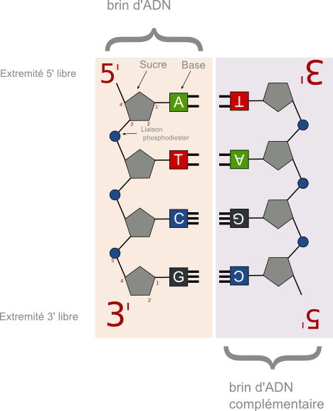
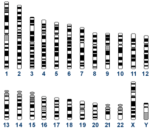
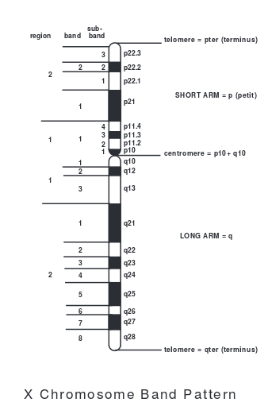
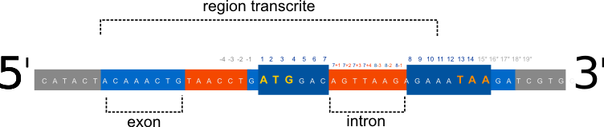
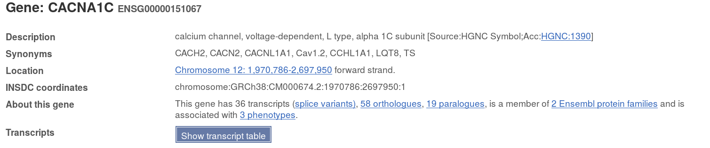

Title: Naviguer dans le Génome humain
Slug: naviguer-dans-votre-adn
Date: 2015-04-06 16:25:55
Tags: bioinformatique, biologie
Category: biologie
Author: Sacha Schutz
SIDEBARIMAGE:images/post8/cover.jpg

Dans ce post, nous allons voir comment naviguer dans le génome humain. Celui ci a été entièrement séquencé grâce à un consortium international de chercheurs au sein du *[Human Genom Project](https://fr.wikipedia.org/wiki/Projet_g%C3%A9nome_humain)* entre 1990 et 2003. Ce génome fait environ 3 milliards de bases, soit un fichier texte d'environ 3 GigaOctets que vous pouvez télécharger [ici](http://hgdownload.cse.ucsc.edu/goldenPath/hg38/bigZips/hg38.fa.gz). Aujourd'hui, le génome accompagné de ses annotations est disponible intégralement sur internet par l’intermédiaire de bases de données publiques.   
Pour se repérer dans ces méandres de données, il nous faut comprendre l'organisation du génome et connaître les différents systèmes de coordonnées et leurs nomenclatures. Ce post sera donc le prélude à votre voyage. 

#L'ADN
L'ADN est une longue molécule localisée dans les noyaux de nos cellules qui constitue un support biologique d'information. Au même titre qu'un fichier binaire, l'information est stocké numériquement. C'est à dire qu'au lieu d'utiliser 2 symboles comme un fichier binaire (1 et 0), l'ADN utilise 4 symboles matérialisés par les 4 bases azotées Adénine(A), Cytosine(C), Guanine(G), Tymine(T). D'ailleurs il est tout à fait possible de stocker des données informatiques dans un brin d'ADN comme le suggère [ce post ](http://www.ibtimes.com.au/worlds-first-biological-computer-decrypts-images-stored-dna-1293424). 

    

Ces bases sont agencées linéairement sur un brin par l’intermédiaire d'un sucre (le désoxyribose) qui se lie à ses voisins par un liaison phosphodiester, soit par son carbone en 5' soit par son carbone en 3'(Voir schéma ci dessus). 
Un brin d'ADN est ainsi polarisé, avec deux extrémités libres différentes (5' et 3'), et sa lecture se fait toujours dans le sens 5' vers 3'. C'est en effet dans ce sens, et uniquement dans ce sens, que s'effectue la synthèse ou polymérisation de l'ADN. Sur la figure précédente, le brin d'ADN de gauche est lu **5'-ATCG-3'**.    
L'information codé sur un brin d'ADN est doublée par la présence d'un brin complémentaire anti-parallèle (à droite). Celui-ci se forme par les liaisons hydrogènes entre A et T d'une part et C et G d'autre part. Les deux brins réunis forment la double hélice d'ADN. Cette parité de l'information autorise une correction d'erreur en cas de perte de base sur l'un des deux brins. Ce mécanisme évoque d'autres systèmes de correction, utilisé cette fois en informatique, comme le [parity bit](https://en.wikipedia.org/wiki/Parity_bit). 
La séquence complémentaire étant anti-parallèle, elle se lit du bas vers le haut. Soit **5'-CGAT-3'** .  

##Le génome humain 
Le génome humain est constitué d'une longue séquence de 3,2 milliards de bases réparties sur 24 chromosomes. Chaque chromosome est constitué d'une molécule d'ADN double brin.

    

Il ne faut pas confondre le génome humain avec le genotype d'une personne. En effet, chaque individu est l'expression de deux génomes combinés: Le génome maternel et le génome paternel. Chacune de nos cellules possède ainsi  22 **paires** de chromosomes et une paire de chromosome sexuelle XX ou XY.    

### Un ou plusieurs génomes ?
La variabilité du génome humain est responsable de la diversité de notre espèce. Chaque personne possède une séquence d'ADN qui lui est propre. Pourtant, on parle "*du génome humain*" comme d'une seul entité.   
Il s'agit en fait, d'une séquence consensus réalisée à partir de plusieurs individus où chaque base d'une position est la plus représentative parmi les génomes testés. On appelle ça un «*[genome assembly](https://en.wikipedia.org/wiki/Genome_project#Genome_assembly)*». Cette séquence est continuellement mise à jour par le [GRC (Genome Reference Consortium)](http://www.ncbi.nlm.nih.gov/projects/genome/assembly/grc/). À ce jour, la dernière version du génome humain est la [**GRCh38**](http://www.ncbi.nlm.nih.gov/projects/genome/assembly/grc/human/) disponible sur NCBI. Vous pouvez  également le trouver sur [UCSC](https://genome-euro.ucsc.edu/index.html) sous le nom [**hg38**](https://genome-euro.ucsc.edu/cgi-bin/hgGateway?db=hg38&redirect=manual&source=genome.ucsc.edu). Attention toute fois, la précédente version GRCh37 du NCBI correspond à la version hg19 de UCSC.  
Ce génome, comme n'importe quelle séquence d'ADN, est sauvegardé dans un fichier texte dont le format standard est le **[fasta](https://fr.wikipedia.org/wiki/FASTA_%28format_de_fichier%29)**. Il existe aussi un format binaire **[2bit](http://jcomeau.freeshell.org/www/genome/2bitformat.html)**, ou chaque base est codé sur 2 bits au lieu de 8 bits. Tout le génome humain passe alors de 3 Gigaoctets à 750 Megaoctets. Mais celui-ci étant moins pratique on lui préfère le fasta. (exemple ci dessous)

        >maSequence1 commentaire
        GTGCCGAGCTGAGTTCCTTATAAGAATTAATCTTAATTTTGTATTTTTTCCTGTAAGACAATAGGCCATG
        TTAATTAAACTGAAGAAGGATATATTTGGCTGGGTGTTTTCAAATGTCAGCTTAAAATTGGTAATTGAAT
        GGAAGCAAAATTATAAGAAGAGGAAATTAAAGTCTTCCATTGCATGTATTGTAAACAGAAGGAGATGGGT
        GATTCCTTCAATTCAAAAGCTCTCTTTGGAATGAACAATGTGGGCGTTTGTAAATTCTGGAAATGTCTTT
        CTATTCATAATAAACTAGATACTGTTGATCTTTTAAAAAAAAAAAA

Essayez pour voir, de lire le fichier que vous avez téléchargé plus haut. Pour ceux qui sont sous linux, la commande *less* fera l'affaire. Ce fichier est le génome humain dans sa version hg38. Il contient toutes les séquences réparties sur les 24 chromosomes avec aussi l'ADN mitochondrial. Chacune de ces séquences est séparée par une ligne commençant par '>' associé au nom du chromosome.  
Depuis ce fichier, vous pouvez localiser n'importe quel gène... Mais avant ça, il faut savoir comment se localiser!

#Se localiser dans le génome
##Les coordonnées chromosomiques

    

Un chromosome est composé d'un bras court (p) et d'un bras long (q), séparés par un centromère. Grâce aux colorations réalisées en cytogénétique, on distingue des régions contenant des bandes qui elles-mêmes contiennent des sous-bandes.  
Les numéros des régions, des bandes et des sous-bandes  sont attribués dans l'ordre croissant, depuis le centromère vers les extrémités appelées télomètres (Voir schéma ci dessus). Ainsi, pour localiser une zone d’intérêt dans le génome en coordonnées chromosomiques. on s'aide de la nomenclature suivante:

{chromosome}{bras}{region}{bande}.{sous-bande}

Par exemple, le gène **[CFTR](https://fr.wikipedia.org/wiki/G%C3%A8ne_et_prot%C3%A9ine_CFTR)** impliqué dans la mucoviscidose se trouve dans la zone **7q31.2**. C'est à dire sur: le bras long du chromosome 7, la 3ième région, la bande 1, la sous-bande 2 . 
La résolution d'une sous bande est de l'ordre de 2 millions de base. Ces coordonnés permettent uniquement de cibler des grandes zones du génome et sont principalement utilisées dans la détection de grandes mutations par les cytogénéticiens, à l'aide de techniques comme le [caryotype](https://fr.wikipedia.org/wiki/Caryotype), la [FISH](https://fr.wikipedia.org/wiki/Hybridation_in_situ_en_fluorescence) ou la [CGH array](https://fr.wikipedia.org/wiki/Puce_d%27hybridation_g%C3%A9nomique_comparative). 

##Les coordonnées génomiques
Contrairement aux coordonnées chromosomiques, la résolution des coordonnées génomiques est de 1 base. La première base d'un chromosome depuis l'extrémité 5' du bras court, porte le nombre 1 (au grand malheur des développeurs qui auraient voulu commencer à zéro). La dernière base à l'extrémité 3' du bras long porte le nombre le plus élevé. Pour sélectionner une région, on s'aide de cette nomenclature:

{chromosome}:{position_début}-{position_fin}

Par exemple, le gène CFTR se trouve exactement dans la zone 7:117465784-117715971.   
Je vous invite à tester par vous même en utilisant l'API publique de [Ensembl](http://rest.ensembl.org/documentation/info/sequence_region). En substituant les derniers paramètres, vous allez pouvoir récupérer la séquence du gène CFTR au format Fasta:

*
[http://rest.ensembl.org/sequence/region/human/7:117465784..117715971:1
](http://rest.ensembl.org/sequence/region/human/7:117465784..117715971:1)*

Maintenant, je suis sûr que vous allez vous demander un jour (si ce n'est pas tout de suite), comment récupérer la séquence du brin complémentaire. Celle que nous avons obtenue s'appelle la **séquence forward**. La séquence complémentaire, s'appelle **séquence reverse** et correspond aux bases complémentaires, mais attention, elle est orientée dans le sens 3'5'. Hors nous avons vu que toutes séquences s’écrient toujours dans le sens 5'3'. Il faut donc retourner la séquence pour pouvoir la lire.  
La requête suivante récupère donc le brin reverse:

*[http://rest.ensembl.org/sequence/region/human/7:117465784..117715971:-1](http://rest.ensembl.org/sequence/region/human/7:117465784..117715971:-1)
*

Observer le schéma ci dessous, pour bien vous familiariser avec cette nomenclature. Dans ce schéma, un séquence de 10 bases à été sélectionnée.

    

Les coordonnées génomiques sont utilisées en génétique pour localiser des zones précises du génome et pour décrire précisément des mutations. Par exemple la notation **chr1:g.35227587C>G** correspond à la substitution d'un C par un G en position 35227587 sur le chromosome 1. 

##Les coordonnées exoniques

    

Au lieu d'utiliser le génome entier comme repère, on peut se servir du gène. Dans ce contexte, un gène est une séquence pouvant être transcrite et traduite en protéine. Un gène est composé d'introns (non transcrits) et d'exons (transcrits).   
Lorsqu'on se repère en coordonnée exonique, on doit obligatoirement faire référence à un gène. Puis on donne le numéro **1** à la première base qui sera traduite, c'est à dire le A du codon initiateur ATG. Comme d'habitude il n'y a pas de numéro 0... *« soupir »*   
Toutes les bases avant le codon initiateur sont numérotées **-1,** **-2** etc.  Les bases après le codon stop mettant fin à la traduction sont numérotées **1\* **,** 2\* ** etc.  
Les introns sont numérotés par rapport à l'exon le plus proche. Pour le début de l'intron **e+1**, **e+2** etc.. et pour la fin **e-1**, **e-2** etc...  
Cette nomenclature est définit par l'[HGVS](http://www.hgvs.org). Elle est utilisé majoritairement pour décrire les mutations retrouvées dans l'ADN. Je détaillerai cette nomenclature dans un prochain post. Notons juste comme exemple, la mutation principale retrouvée dans la mucoviscidose, une délétion de 3 bases (CTT) responsable d'une perte de phénylalanine dans la protéine CFTR se note : **c.1521_1523delCTT **

##Conversion entre systèmes de coordonnées
Convertir des coordonnées exoniques en génomiques n'est pas aussi simple qu'il n'y parait. En effet, un gène peut se trouver sur le brin forward ou reverse. Or, comme nous l'avons vu précédemment, les coordonnées génomiques sur le brin reverse se lisent à l'envers. Donc pour un gène situé sur le brin reverse, les positions 1,2,3,4 ( ordre croissant ) en cordonnées exoniques se lirons  1000, 999, 998 (ordre décroissant) en coordonnées génomiques. Faite un dessin, vous comprendrez... !    
De plus pour compliquer le tout, les coordonnées génomiques varient en fonction de la version du génome que vous utilisez. Les coordonnées en GRCh38 ne sont pas les mêmes que ceux en GRCh37.   
Vérifiez toujours, lorsque vous étudiez un gène, sur quel brin vous êtes et quel génome vous utilisez. Aidez vous des outils pour faire vos conversions. Ensembl dispose d'une API REST pour faire  ce *mapping* de coordonnées [ici].http://rest.ensembl.org/documentation/info/assembly_cdna) 

#Travaux appliqués 
Pour s’exercer avec ce que vous avez appris, et faire plaisir à un ami du [psylab](https://www.youtube.com/user/lepsylab), essayons de rechercher des informations sur un gène,  le gène CACNA1C impliqué dans la schizophrénie.   
Pour cela, allez sur le site [ensembl](http://www.ensembl.org/Homo_sapiens/Info/Index) et recherchons le gène CACNA1C dans la barre de recherche.   
Vous retrouverez alors toutes les informations utiles à propos de ce gène sur cette [page](http://www.ensembl.org/Homo_sapiens/Gene/Summary?db=core;g=ENSG00000151067;r=12:1970786-2697950). 

    

Il s'agit d'un gène situé sur le chromosome 12, en position génomique 1970786-2697950 orienté sur le brin forward. Ce gène se trouve en position p13.33, soit une région du bras court du chromosome 12. 

#Conclusion
Pour finir, je vais vous laisse vous amuser avec différents *genome browser* existants. ce sont des sites web qui vous permettent de naviguer visuellement dans le génome, extraire des données et obtenir des informations complémentaires. Essayez par exemple, de retrouver , ou se trouve le gène HFE impliqué dans l'hémochromatose, sa position chromosomique et génomique ainsi que sa séquence.

- [Ensembl](http://www.ensembl.org/Homo_sapiens/Info/Index)
- [Ensembl API REST](http://rest.ensembl.org/)
- [UCSC](http://genome.ucsc.edu/cgi-bin/hgTracks)
- [1000genomes](http://www.ncbi.nlm.nih.gov/variation/tools/1000genomes/)
- [Annmap](http://annmap.cruk.manchester.ac.uk/)

# references
* [dnanexus](https://wiki.dnanexus.com/Scientific-Notes/human-genome)
* [alternateallele](http://alternateallele.blogspot.fr/2012/03/genome-coordinate-conventions.html)
* [HGVS](http://www.hgvs.org/mutnomen/refseq.html)
* [ENSEMBL](http://www.ensembl.org/Homo_sapiens/Info/Index)