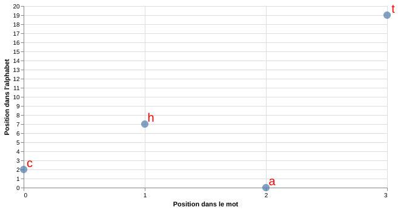
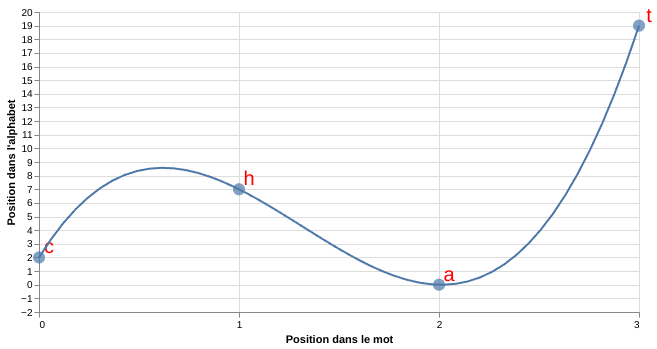
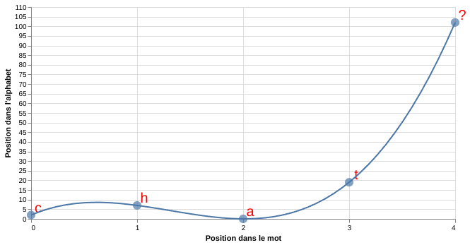

Title: Code d'erreur de Reed-Solomon 
Slug: reed-solomon
Date: 2024-09-30 19:30:31
Modified: 2024-09-30 19:30:31
Tags: algorithme
Category: informatique
Author: Sacha schutz
SIDEBARIMAGE:images/common/term_banner.jpeg

Le code de [Reed-Solomon](https://fr.wikipedia.org/wiki/Code_de_Reed-Solomon) est un algorithme conçu pour corriger des erreurs dans une séquence de données en utilisant des symboles supplémentaires. C'est un système de [correction d'erreurs](https://fr.wikipedia.org/wiki/Code_correcteur) utilisé par exemple pour lire vos vieux [CD-ROM](https://en.wikipedia.org/wiki/Cross-interleaved_Reed%E2%80%93Solomon_coding) rayés.    
Pour mieux comprendre, imaginez que je vous transmets lettre par lettre le mot **c-h-a-t**, mais que la troisième lettre se corrompt en chemin pour devenir **c-h-x-t**. Vous ne pourrez pas interpréter le message correctement. Cependant, en ajoutant un symbole supplémentaire à mon message, par exemple **c-h-a-t-y**, vous allez pouvoir identifier et corriger un erreur peut importe ou elle se trouve grâce au code de Reed-Solomon.

Nous allons donc explorer le fonctionnement de cet algorithme à travers l'exemple du mot *c-h-a-t* et voir comment réaliser cette operation avec notre language préféré [Python](https://www.python.org/).
 
## Representation du mot chat dans un espace discret

Tout d'abord, representons les lettres du mot *chat* sur un graphique où l'axe des ordonnées indique la position de chaque lettre dans l'alphabet, tandis que l'axe des abscisses correspond à leur position dans le mot. Par exemple, le **C** est la première lettre du mot *chat* et la troisième lettre de l'alphabet, donc ses coordonnées seront (0, 2). De même, nous aurons **H** (1, 7), **A** (2, 0) et **T** (3, 19).

<div class="figure">
     
<div class="legend">

Representation du mot chat dans un espace ou l'axe X represente la position d'une lettre dans le mot
et l'axe Y la position de la lettre dans l'alphabet. L'index des positions commence à zero.

</div>
</div>


Deux éléments importants à comprendre concernant ce graphique. Tout d'abord, le domaine des valeurs est discret. En effet, les positions sont des nombres entiers, car il est impossible d'avoir une position comme 1,5.
Ensuite, observez la borne supérieure de l'axe des ordonnées, qui est égale à 26. Cela correspond au nombre de lettres dans l'alphabet. Nous verrons plus tard, que nous pouvons utiliser l'algèbre modulaire pour avoir une lettre à la position 27.


## Interpolation lagrangienne
Maintenant trouvons une fonction mathématique qui passe par ces quatre points. Plus précisément, nous allons rechercher un [polynôme](https://fr.wikipedia.org/wiki/Polyn%C3%B4me) de degré 3 (correspondant au nombre de lettres moins un) en effectuant une [interpolation Lagrangienne](https://fr.wikipedia.org/wiki/Interpolation_lagrangienne).
Cette méthode est relativement simple à comprendre, et je vous invite à l'explorer par vous-même. Nous réaliserons cette interpolation directement en Python en utilisant ```scipy.interpolate.lagrange```.

```python

from scipy.interpolate import lagrange

x = [0,1,2,3]
y = [2,7,0,19]
polynome = lagrange(x,y)

polynome(4)  

```

Nous obtenons alors le graphique suivant:


<div class="figure">
     
<div class="legend">

Polynome de degré 3 passant par les 4 points. Ce polynome a été obtenu grâce à une interpolation lagrangienne.

</div>
</div>


Il est important de comprendre que ce polynôme est unique. Il n'y a qu'un seul polynome de degré 3 qui 
passe par ces 4 points. Si vous connaissez au minimum 3 points vous pouvez déduire le polynome de degré 4 et prédire n'importe
quel point manquant. C'est sur ce principe que se base la correction d'erreur de Reed-solomon. Vous allez utiliser suffisament de symboles surnuméraires pour prédire le polynome et par conséquence prédire les symboles pour n'importe quelles positions.


## Ajout du symbole de correction

Pour déterminer le symbole de correction à utiliser à la cinquième position du mot, il suffit de calculer 
**polynome(5) = 102**. Ainsi, le symbole de de correction à utilisé est la 102ème lettre de l'alphabet. Mais attendez, il n'y a que 26 lettres dans l'alphabet ! En effet, ce que je vous ai dit n'est pas tout à fait exact. En réalité, le polynôme de Lagrange est recherché dans un [espace de Galois](https://fr.wikipedia.org/wiki/Groupe_de_Galois) où l'arithmétique modulaire s'applique. Imaginez que l'alphabet est disposé en cercle : après la lettre Z, vous revenez à la lettre A et recommencer le comptage. Dans cette espace tous les opérateurs mathématiques sont respectés. Z + 3 = C par exemple. Ainsi, la 102ème lettre de l'alphabet est la lettre Y.    


<div class="figure">
     
<div class="legend">

Il suffit d'utiliser le polynome pour identifier le symbole de correction d'erreur.
Sur les 5 points representés, seul 4 sont nécessaires pour trouver le polynôme.

</div>
</div>

Vous pouvez ajouter autant de symboles de correction d'erreur que vous le souhaitez. Pour un mot de N lettres avec un seul symbole de correction d'erreur, vous devez connaître N-1 symboles pour valider le code de Reed-Solomon. Si vous ajoutez trois symboles, cela signifie que vous pouvez perdre jusqu'à trois symboles et les retrouver. 

## En pratique 
En pratique, vous pouvez utiliser la bibliothèque Python [reedsolo](https://github.com/tomerfiliba-org/reedsolomon), disponible sur [PyPI](https://pypi.org/project/reedsolo/), pour encoder une chaine de caractères. Par exemple, pour encoder le mot *hello* en utilisant 10 symboles de correction d'erreurs :

```python
from reedsolo import RSCodec
rsc = RSCodec(10)
message = rsc.encode(b'hello')  
print(message)   # bytearray(b'hello\xec\x8e')

# Alteration du message 
message[0] = 0
message[2] = 0 

# Retrouver le message original 
correction , _, _= rsc.decode(message)
print(correction) # bytearray(b(hello))
```
 
## Conclusion 
Le code de correction d'erreur Reed-Solomon est remarquable pour sa capacité à corriger et à identifier des erreurs, peu importe leurs positions dans le message. Vous trouverez également d'autres codes correcteurs, tels que le [code de Hamming](https://fr.wikipedia.org/wiki/Code_de_Hamming) et le [code de Golay](https://fr.wikipedia.org/wiki/Code_de_Golay), chacun ayant ses propres avantages et inconvénients.

PS : J'ai changé le backend de mon blog. Je vais essayer de publier plus court mais beaucoup plus chaque semaine dans des domaines plus datascience/info et moins bioinfo. Donc lachez des commentaires pour me motiver. 


## Références  
- [ Vidéo youtube ](https://www.youtube.com/watch?v=1pQJkt7-R4Q&themeRefresh=1)
- [infoscience](https://infoscience.epfl.ch/server/api/core/bitstreams/238e2ed1-6e61-4a8f-8454-82a08557316d/content)
- [reedsolo](https://github.com/tomerfiliba-org/reedsolomon)